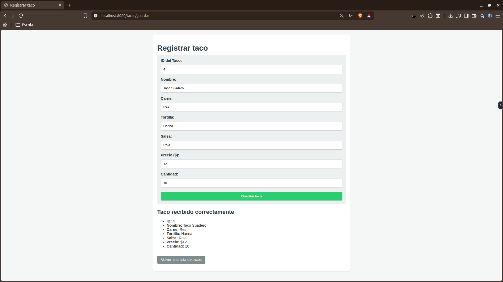
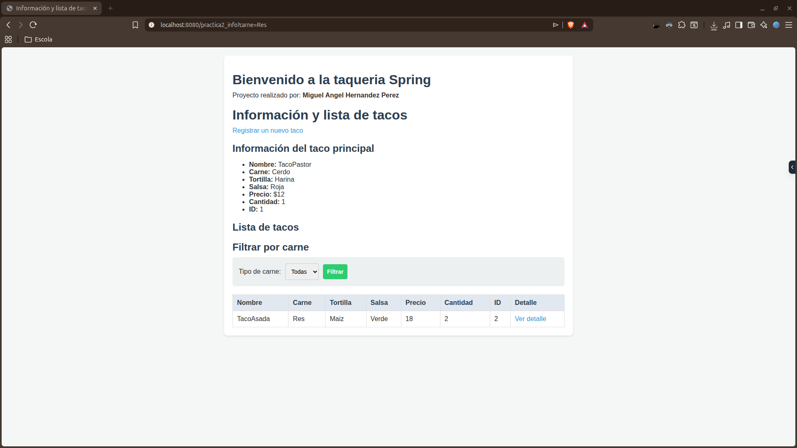
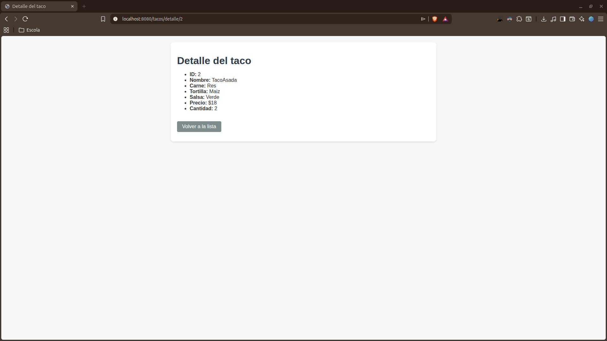
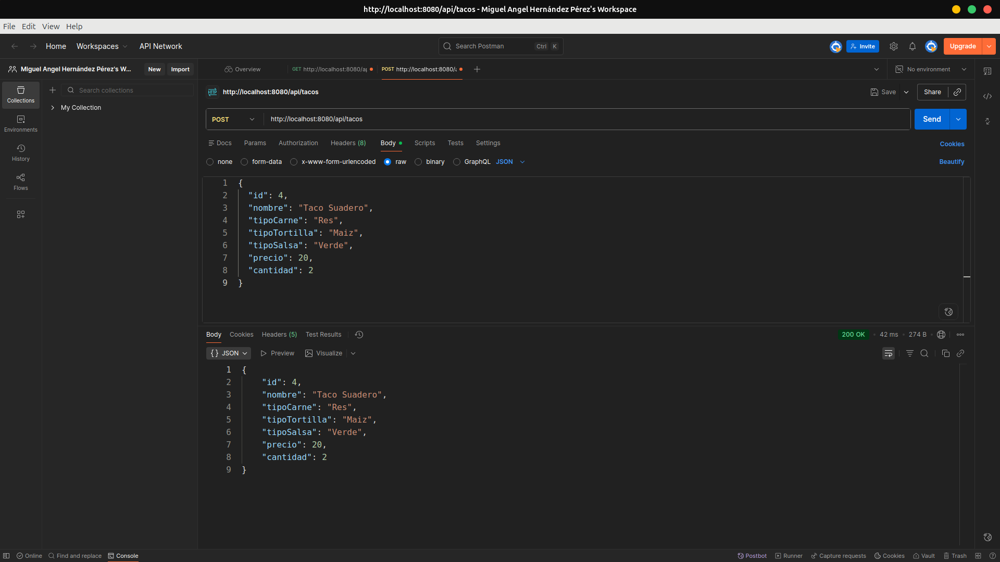

# Proyecto de Gestión de Tacos - Spring Boot

Este proyecto es una aplicación web en Spring Boot desarrollada para la gestión e información de tacos. Implementa controladores MVC con vistas dinámicas en Thymeleaf, así como controladores REST para la comunicación con clientes externos.

---

## Requisitos de la Fase 1 Implementados

1. **Dependencia de Thymeleaf**:
   - Integración de `spring-boot-starter-thymeleaf` para renderizado dinámico de vistas HTML.

2. **Clase DTO (Data Transfer Object)**:
   - Clase `TacoDTO` que encapsula la información de los tacos transferida entre las vistas/APIs y el controlador.

3. **Controlador MVC y Vistas Thymeleaf**:
   - **Listado**: Despliegue de tacos dinámicamente mediante el atributo `Model` y recorrido con `th:each`.
   - **Formulario**: Formulario de captura enlazado mediante `@ModelAttribute` para registrar nuevos tacos de manera interactiva.

4. **Parámetros de Ruta y Filtros**:
   - **`@RequestParam`**: Filtrado dinámico del listado por tipo de carne (ej. `carne=Res`).
   - **`@PathVariable`**: Detalle de taco individual consultado dinámicamente mediante su ID en la URL.

5. **Inyección de Propiedades**:
   - Uso de `@Value` para inyectar valores dinámicos como `config.usuario` y `config.mensaje` declarados en `application.properties`.

6. **REST POST Endpoint**:
   - Implementación de un `@RestController` con mapeo POST en `/api/tacos` que recibe y retorna un objeto JSON mediante `@RequestBody`.

---

## Evidencias de Funcionamiento (Fase 1)

### 1. Vista con el listado (th:each funcionando)
Muestra la lista de tacos disponibles, el título principal y la información general del taco destacado.
* **Rubro demostrado**: Vista con el listado (th:each funcionando)
* **Ruta**: `http://localhost:8080/practica2_info`


---

### 2. Formulario con @ModelAttribute
Captura y procesa un nuevo Taco a través del formulario, mostrando un banner de confirmación con los datos capturados tras enviarlo.
* **Rubro demostrado**: Formulario con @ModelAttribute
* **Ruta**: `http://localhost:8080/tacos/formulario`



---

### 3. Resultado de endpoint con @RequestParam
Permite filtrar dinámicamente el listado de tacos mostrando únicamente aquellos del tipo de carne especificado en los parámetros de la URL.
* **Rubro demostrado**: Resultado de endpoint con @RequestParam (filtrado por carne)
* **Ruta**: `http://localhost:8080/practica2_info?carne=Res`



---

### 4. Resultado de endpoint con @PathVariable
Consulta y despliega de manera estructurada los atributos de un taco específico proporcionando su ID en la URL.
* **Rubro demostrado**: Resultado de endpoint con @PathVariable (detalle por ID)
* **Ruta**: `http://localhost:8080/tacos/detalle/2`



---

### 5. Petición POST probada en Postman/Bruno
Demuestra el funcionamiento del `TacoRestController` recibiendo y respondiendo la representación del taco en formato JSON con estado 200 OK.
* **Rubro demostrado**: Petición POST probada en Postman/Bruno
* **Ruta**: `POST http://localhost:8080/api/tacos`



---

## Cómo Ejecutar el Proyecto Localmente

1. Clona o abre el proyecto en tu entorno de desarrollo.
2. Configura e instala las dependencias de Maven ejecutando:
   ```bash
   ./mvnw clean compile
   ```
3. Ejecuta la aplicación de Spring Boot:
   ```bash
   ./mvnw spring-boot:run
   ```
4. Abre tu navegador y accede a `http://localhost:8080/practica2_info`.
